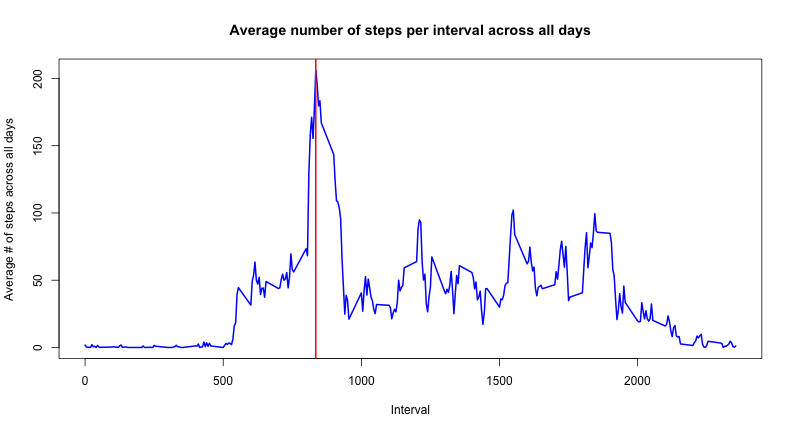

Reproducible Research Peer Assessment 1
========================================================

## Loading and preprocessing the data

In the start, we can check the working directory with `getwd()` and if needed we can set the working directory using `setwd()` command. First we need to load the data in the R/RStudio and then do some preprocessing to clean the data and make the data presentable for analysis. The data looks in good shape, we only need to convert the dates into a `POSIXlt` class for convenience.


```r
unzip("activity.zip") # Unzip archive
dat <- read.csv("activity.csv") # Read in data file

# Turn the date data into a valid date class
# Allows for easier processing
# Dates are in YYYY-MM-DD format
dates <- strptime(dat$date, "%Y-%m-%d")
dat$date <- dates

# Keep a list of all possible days
uniqueDates <- unique(dates)
# Keep a list of all possible intervals
uniqueIntervals <- unique(dat$interval)
```

## What is the mean total number of steps taken per day?

It is a good idea to split up the data first into individual data frames where each data frame represents the data for a particular day. In the end, we can accumulates all of the steps taken for each day into a vector. Each element in this vector represents the total number of steps taken for a particular day (61 in total). Here we ignore `NA` values.


```r
# Part 2 - Create a histogram of the total number of steps taken
# each day
# First split up the data frame for steps by day
stepsSplit <- split(dat$steps, dates$yday)

# Next find the total number of steps over each day
totalStepsPerDay <- sapply(stepsSplit, sum, na.rm=TRUE)

# Plot a (pseudo) histogram where the x-axis denotes the day
# and the y-axis denotes the total number of steps taken 
# for each day
plot(uniqueDates, totalStepsPerDay, main="Histogram of steps taken each day", 
     xlab = "Date (October to November 2012)", ylab = "Frequency", type = "h", 
     lwd = 8, col = "blue")
```

 

The mean steps per day are:


```r
meanStepsPerDay <- sapply(stepsSplit, mean, na.rm=TRUE)
meanDataFrame <- data.frame(date=uniqueDates, meanStepsPerDay=meanStepsPerDay, row.names=NULL)
meanDataFrame
```

```
##          date meanStepsPerDay
## 1  2012-10-01             NaN
## 2  2012-10-02       0.4375000
## 3  2012-10-03      39.4166667
## 4  2012-10-04      42.0694444
## 5  2012-10-05      46.1597222
## 6  2012-10-06      53.5416667
## 7  2012-10-07      38.2465278
## 8  2012-10-08             NaN
## 9  2012-10-09      44.4826389
## 10 2012-10-10      34.3750000
## 11 2012-10-11      35.7777778
## 12 2012-10-12      60.3541667
## 13 2012-10-13      43.1458333
## 14 2012-10-14      52.4236111
## 15 2012-10-15      35.2048611
## 16 2012-10-16      52.3750000
## 17 2012-10-17      46.7083333
## 18 2012-10-18      34.9166667
## 19 2012-10-19      41.0729167
## 20 2012-10-20      36.0937500
## 21 2012-10-21      30.6284722
## 22 2012-10-22      46.7361111
## 23 2012-10-23      30.9652778
## 24 2012-10-24      29.0104167
## 25 2012-10-25       8.6527778
## 26 2012-10-26      23.5347222
## 27 2012-10-27      35.1354167
## 28 2012-10-28      39.7847222
## 29 2012-10-29      17.4236111
## 30 2012-10-30      34.0937500
## 31 2012-10-31      53.5208333
## 32 2012-11-01             NaN
## 33 2012-11-02      36.8055556
## 34 2012-11-03      36.7048611
## 35 2012-11-04             NaN
## 36 2012-11-05      36.2465278
## 37 2012-11-06      28.9375000
## 38 2012-11-07      44.7326389
## 39 2012-11-08      11.1770833
## 40 2012-11-09             NaN
## 41 2012-11-10             NaN
## 42 2012-11-11      43.7777778
## 43 2012-11-12      37.3784722
## 44 2012-11-13      25.4722222
## 45 2012-11-14             NaN
## 46 2012-11-15       0.1423611
## 47 2012-11-16      18.8923611
## 48 2012-11-17      49.7881944
## 49 2012-11-18      52.4652778
## 50 2012-11-19      30.6979167
## 51 2012-11-20      15.5277778
## 52 2012-11-21      44.3993056
## 53 2012-11-22      70.9270833
## 54 2012-11-23      73.5902778
## 55 2012-11-24      50.2708333
## 56 2012-11-25      41.0902778
## 57 2012-11-26      38.7569444
## 58 2012-11-27      47.3819444
## 59 2012-11-28      35.3576389
## 60 2012-11-29      24.4687500
## 61 2012-11-30             NaN
```

The median steps per day are:

```r
medianStepsPerDay <- sapply(stepsSplit, median, na.rm=TRUE)
medianDataFrame <- data.frame(date=uniqueDates, medianStepsPerDay=medianStepsPerDay, row.names=NULL)
medianDataFrame
```

```
##          date medianStepsPerDay
## 1  2012-10-01                NA
## 2  2012-10-02                 0
## 3  2012-10-03                 0
## 4  2012-10-04                 0
## 5  2012-10-05                 0
## 6  2012-10-06                 0
## 7  2012-10-07                 0
## 8  2012-10-08                NA
## 9  2012-10-09                 0
## 10 2012-10-10                 0
## 11 2012-10-11                 0
## 12 2012-10-12                 0
## 13 2012-10-13                 0
## 14 2012-10-14                 0
## 15 2012-10-15                 0
## 16 2012-10-16                 0
## 17 2012-10-17                 0
## 18 2012-10-18                 0
## 19 2012-10-19                 0
## 20 2012-10-20                 0
## 21 2012-10-21                 0
## 22 2012-10-22                 0
## 23 2012-10-23                 0
## 24 2012-10-24                 0
## 25 2012-10-25                 0
## 26 2012-10-26                 0
## 27 2012-10-27                 0
## 28 2012-10-28                 0
## 29 2012-10-29                 0
## 30 2012-10-30                 0
## 31 2012-10-31                 0
## 32 2012-11-01                NA
## 33 2012-11-02                 0
## 34 2012-11-03                 0
## 35 2012-11-04                NA
## 36 2012-11-05                 0
## 37 2012-11-06                 0
## 38 2012-11-07                 0
## 39 2012-11-08                 0
## 40 2012-11-09                NA
## 41 2012-11-10                NA
## 42 2012-11-11                 0
## 43 2012-11-12                 0
## 44 2012-11-13                 0
## 45 2012-11-14                NA
## 46 2012-11-15                 0
## 47 2012-11-16                 0
## 48 2012-11-17                 0
## 49 2012-11-18                 0
## 50 2012-11-19                 0
## 51 2012-11-20                 0
## 52 2012-11-21                 0
## 53 2012-11-22                 0
## 54 2012-11-23                 0
## 55 2012-11-24                 0
## 56 2012-11-25                 0
## 57 2012-11-26                 0
## 58 2012-11-27                 0
## 59 2012-11-28                 0
## 60 2012-11-29                 0
## 61 2012-11-30                NA
```

Here is a sample between October 5th to October 10th of 2012:


```r
stepsSplit[5:7]
```

```
## $`278`
##   [1]   0   0   0   0   0   0   0   0   0   0   0   0   0   0   0   0   0
##  [18]   0   0   0   0   9  14   0   0   0   0   0   0   7   0   0   0   0
##  [35]  27   0   0   0   0   0   0   0   0   0   0   0   0   0   0  39   0
##  [52]   0   0   0   0   0   0   0   0   0   0  27   0   0   0   0   0   0
##  [69]   0   0   0  52  36   0   0  28  67 119   7  21  29  68  29   0  11
##  [86]  19  84  50   2  43 126  30  19   8 171  68 114   0   9 122 400 451
## [103] 371 470 473 512 449 496 530 509 252  84  16   0   6  46  39   0   0
## [120]   0   0   0   0   0   0   0   0   0   0   0   0   0   0   0   0   0
## [137]   0   0   0   0   0   0   0   0 138 541 555 345 345  10 485 515 168
## [154]   0   0   0   0   0   0   0 349 341   0   0   0   0   0 158 545  82
## [171]   0 105   0   0   0   0   0   0   0   0   0   0   0   0   0   0   0
## [188]   0 326 172 332 402  70   0   0   0   0   0   0   0   0   0   0   0
## [205]   0   0   0  53   0   0   0   0   0   0   7  10  65  40  15  29   0
## [222]  20  35  69  25  46  15  26  33  58  75  59   0   0   0   0   0   0
## [239]   0   0   0   0   0   0   0   0   0  71   0   0   0   0   0   0   0
## [256]   0   0   0   0   0   0   0   0   0   0   0   0   0   0   0   0   0
## [273]   0   0   0   0   0   0   0   0   0   0   0   0   0   0   0   0
## 
## $`279`
##   [1]   0   0   0   0   0   0   0   0   0   0   0   0   0   0   0   0   0
##  [18]   0   0   0   0   0   0   0   0   0   0   0   0   0   0   0   0   0
##  [35]   0   0   0   0   0   0   0   0  40  11   0   0   0   0   0   0   0
##  [52]   0   0  19  67   0   0   0   0   0   0   0   0   0   0   0   0   0
##  [69]  27   0   0   0   0   0   0  36  50  38   0   4  42  14   8 135 172
##  [86] 124  31  52   0 104 170  58   0   0  75   0   0 211 321 149   0  82
## [103]  94 225 216 199  50 187  30   0  65 173  43   0   0   0   0   0   0
## [120]   0  16  26   0   0   0   0   0   0   0   0   0   0   0   0   0   0
## [137]   0   0   0  95  64   7  33  72 221 439 519 440 394  97  71  10  87
## [154] 443 500 465 485 351 515 511 506 486 171  12  24  42 140  15   0  43
## [171]  67  48   0   0   9  31  30  64 115  25   0  27   0   0   0   0   0
## [188]   0   0   0   0   0  27  27   0   0   9   0   0  54  35   0  49   0
## [205]   0   0   0  93   0   0  13   0   6  12   0   0  34  77 173 370 402
## [222] 504 485 437 526 264   0  35 124  93   0   0   0   0   0   0   0   0
## [239]   0   0   0   0  33 118   0   6   0 262  33  46  35   0   0   0   0
## [256]   0   0   0   0   0   0   0   0   0   0   0   0   0   0   0   0   0
## [273]   0   0   0   0   0   0   0   0   0   0   0   0   0   0   0   0
## 
## $`280`
##   [1]   0   0   0   0   0   0   0   0   0   0   0   7   0  36   0   0   0
##  [18]   0   8   0   0  11   0   0   0   0   0   0   0   0   0   0   0   0
##  [35]   0   0   0   0   0   0   0   0   0   0   0   0   0   0   0   0   0
##  [52]   0   0   0   0   0  36   0   0   0   0   0   0   0   0   0   0   0
##  [69]   0   0   0   0   0   0   0  34  13   7  71   0   0  10  29  19  30
##  [86]   0  43   0  99  66   0   0  43  40  19  74 121  73   0  27  99  58
## [103]  62   0   0   0   0   0  23   0 223 312 106 284  88 124 102 230  78
## [120] 207 281 247 235 334 389 414  88   0   0   0   0  19   0  16   0   0
## [137]   0  68  64   0 118  26   0  34  18  34  28   0   0   0  37  40  35
## [154]  53  15  12   0   0  16   0   0   0  44   0   0   0   0   0   0   0
## [171]   0   0   0  11  11   0   0   0   0   0   0   0   0   0   0   0   0
## [188]   0   0  80   0   0   0   0  12  25  30  50   0  83  13 146 422 453
## [205] 411 439 523 413  13 165   0  79   7 142 107   0  90  17  18  61   0
## [222]   0   0  80 190  82  51  30  23  51  31   0   7  49   0   0   0   0
## [239]   0   0   0   0  42 175 170   0 290   0   0   0  36   0 117  72  52
## [256]   8   0   0   0   0   0  61   0   0   0   0   0   0   0   0   0   0
## [273]   0   0   0   0   0   0   0   0   0   0   0   0   0   0   0   0
```

## What is the average daily activity pattern?

We again split up the data into individual data frames and compute the mean for each time interval. Here also `NA` are ignored.


```r
# Part 3 - Time-series plot (type="l")
# x-axis - Time interval (5, 10, 15, ...)
# y-axis - Average number of steps taken across all days for this time interval

# Split up the data according to the interval
intervalSplit <- split(dat$steps, dat$interval)

# Find the average amount of steps per time interval - ignore NA values
averageStepsPerInterval <- sapply(intervalSplit, mean, na.rm=TRUE)

# Plot the time-series graph
plot(uniqueIntervals, averageStepsPerInterval, type="l",
     main="Average number of steps per interval across all days", 
     xlab="Interval", ylab="Average # of steps across all days", 
     lwd = 2, col="blue")

# Find the location of where the maximum is
maxIntervalDays <- max(averageStepsPerInterval, na.rm=TRUE)
maxIndex <- as.numeric(which(averageStepsPerInterval == maxIntervalDays))

# Plot a vertical line where the max is
maxInterval <- uniqueIntervals[maxIndex]
abline(v=maxInterval, col="red", lwd = 2)
```

 

With reference to the above plot, the interval that records the maximum number of steps averaged across all days is:


```r
maxInterval
```

```
## [1] 835
```

## Imputing missing values

To impute the missing values, first we need to calculate the total number of missing values.


```r
# Part 4 - Calculate total amount of missing values in the data set
# Use complete.cases to find a logical vector that returns TRUE
# if it is a complete row (a.k.a. no NA values) and FALSE otherwise
completeRowsBool <- complete.cases(dat$steps)
numNA <- sum(as.numeric(!completeRowsBool))
numNA
```

```
## [1] 2304
```

All missing values `NAs` in the data set are to be replaced with the mean of that particular 5-minute interval the observation.


```r
# Modify the meanStepsPerDay vector that contains the mean steps taken
# for this 5 minute interval
# Each day consists of 288 intervals and there are 61 days in total
# First remove NaN values and replace with 0.  
# NaN values are produced when the entire day was filled with NA values
# Essentially the mean and median would be zero anyway!
meanStepsPerDay[is.nan(meanStepsPerDay)] <- 0

# Now create a replicated vector 288 times
# The reason why we're doing this is because the slots
# in the vector naturally line up with the interval for
# a particular day.  Now, all we have to do is find where
# in the data set there are missing steps, and simply do
# a copy from one vector to the other
meanColumn <- rep(meanStepsPerDay, 288)

# The steps before replacement
rawSteps <- dat$steps

# Find any values that are NA in the raw steps data
stepsNA <- is.na(rawSteps)

# Now replace these values with their corresponding mean
rawSteps[stepsNA] <- meanColumn[stepsNA]

# Throw these back into a new data frame
datNew <- dat
datNew$steps <- rawSteps
```

Now we can look at the histogram of the new data:


```r
# Repeat Part 2 now
# First split up the data frame for steps by day
stepsSplitNew <- split(datNew$steps, dates$yday)

# Next find the total number of steps over each day
# There should not be an NA values and so we don't need
# to set the flag
totalStepsPerDayNew <- sapply(stepsSplitNew, sum)

# Plot a (pseudo) histogram where the x-axis denotes the day
# and the y-axis denotes the total number of steps taken 
# for each day
par(mfcol=c(2,1))
# Plot the original histogram first
plot(uniqueDates, totalStepsPerDay, main="Histogram of steps taken each day before imputing",      xlab="Date (October to November 2012)", ylab="Frequency", type="h", lwd = 8, col="blue")
# Plot the modified histogram after
plot(uniqueDates, totalStepsPerDayNew, main="Histogram of steps taken each day after imputing", xlab = "Date (October to November 2012)", ylab = "Frequency",
     type = "h", lwd = 8, col = "blue")
```

 

Here we have replaced all of the `NaN` values to `0`. The mean steps per day of the new data are:


```r
meanStepsPerDayNew <- sapply(stepsSplitNew, mean)
meanDataFrameNew <- data.frame(date=uniqueDates, meanStepsPerDay=meanStepsPerDay, 
                               meanStepsPerDayNew=meanStepsPerDayNew, row.names=NULL)
meanDataFrameNew
```

```
##          date meanStepsPerDay meanStepsPerDayNew
## 1  2012-10-01       0.0000000         32.3355276
## 2  2012-10-02       0.4375000          0.4375000
## 3  2012-10-03      39.4166667         39.4166667
## 4  2012-10-04      42.0694444         42.0694444
## 5  2012-10-05      46.1597222         46.1597222
## 6  2012-10-06      53.5416667         53.5416667
## 7  2012-10-07      38.2465278         38.2465278
## 8  2012-10-08       0.0000000         32.2632378
## 9  2012-10-09      44.4826389         44.4826389
## 10 2012-10-10      34.3750000         34.3750000
## 11 2012-10-11      35.7777778         35.7777778
## 12 2012-10-12      60.3541667         60.3541667
## 13 2012-10-13      43.1458333         43.1458333
## 14 2012-10-14      52.4236111         52.4236111
## 15 2012-10-15      35.2048611         35.2048611
## 16 2012-10-16      52.3750000         52.3750000
## 17 2012-10-17      46.7083333         46.7083333
## 18 2012-10-18      34.9166667         34.9166667
## 19 2012-10-19      41.0729167         41.0729167
## 20 2012-10-20      36.0937500         36.0937500
## 21 2012-10-21      30.6284722         30.6284722
## 22 2012-10-22      46.7361111         46.7361111
## 23 2012-10-23      30.9652778         30.9652778
## 24 2012-10-24      29.0104167         29.0104167
## 25 2012-10-25       8.6527778          8.6527778
## 26 2012-10-26      23.5347222         23.5347222
## 27 2012-10-27      35.1354167         35.1354167
## 28 2012-10-28      39.7847222         39.7847222
## 29 2012-10-29      17.4236111         17.4236111
## 30 2012-10-30      34.0937500         34.0937500
## 31 2012-10-31      53.5208333         53.5208333
## 32 2012-11-01       0.0000000         32.0149498
## 33 2012-11-02      36.8055556         36.8055556
## 34 2012-11-03      36.7048611         36.7048611
## 35 2012-11-04       0.0000000         32.4504726
## 36 2012-11-05      36.2465278         36.2465278
## 37 2012-11-06      28.9375000         28.9375000
## 38 2012-11-07      44.7326389         44.7326389
## 39 2012-11-08      11.1770833         11.1770833
## 40 2012-11-09       0.0000000         32.3078945
## 41 2012-11-10       0.0000000         32.8706718
## 42 2012-11-11      43.7777778         43.7777778
## 43 2012-11-12      37.3784722         37.3784722
## 44 2012-11-13      25.4722222         25.4722222
## 45 2012-11-14       0.0000000         32.9865210
## 46 2012-11-15       0.1423611          0.1423611
## 47 2012-11-16      18.8923611         18.8923611
## 48 2012-11-17      49.7881944         49.7881944
## 49 2012-11-18      52.4652778         52.4652778
## 50 2012-11-19      30.6979167         30.6979167
## 51 2012-11-20      15.5277778         15.5277778
## 52 2012-11-21      44.3993056         44.3993056
## 53 2012-11-22      70.9270833         70.9270833
## 54 2012-11-23      73.5902778         73.5902778
## 55 2012-11-24      50.2708333         50.2708333
## 56 2012-11-25      41.0902778         41.0902778
## 57 2012-11-26      38.7569444         38.7569444
## 58 2012-11-27      47.3819444         47.3819444
## 59 2012-11-28      35.3576389         35.3576389
## 60 2012-11-29      24.4687500         24.4687500
## 61 2012-11-30       0.0000000         32.2280213
```

The median steps per day are:

```r
medianStepsPerDayNew <- sapply(stepsSplitNew, median)
medianDataFrameNew <- data.frame(date=uniqueDates, medianStepsPerDay=medianStepsPerDay, 
                                 medianStepsPerDayNew=medianStepsPerDayNew, row.names=NULL)
medianDataFrameNew
```

```
##          date medianStepsPerDay medianStepsPerDayNew
## 1  2012-10-01                NA             36.09375
## 2  2012-10-02                 0              0.00000
## 3  2012-10-03                 0              0.00000
## 4  2012-10-04                 0              0.00000
## 5  2012-10-05                 0              0.00000
## 6  2012-10-06                 0              0.00000
## 7  2012-10-07                 0              0.00000
## 8  2012-10-08                NA             36.09375
## 9  2012-10-09                 0              0.00000
## 10 2012-10-10                 0              0.00000
## 11 2012-10-11                 0              0.00000
## 12 2012-10-12                 0              0.00000
## 13 2012-10-13                 0              0.00000
## 14 2012-10-14                 0              0.00000
## 15 2012-10-15                 0              0.00000
## 16 2012-10-16                 0              0.00000
## 17 2012-10-17                 0              0.00000
## 18 2012-10-18                 0              0.00000
## 19 2012-10-19                 0              0.00000
## 20 2012-10-20                 0              0.00000
## 21 2012-10-21                 0              0.00000
## 22 2012-10-22                 0              0.00000
## 23 2012-10-23                 0              0.00000
## 24 2012-10-24                 0              0.00000
## 25 2012-10-25                 0              0.00000
## 26 2012-10-26                 0              0.00000
## 27 2012-10-27                 0              0.00000
## 28 2012-10-28                 0              0.00000
## 29 2012-10-29                 0              0.00000
## 30 2012-10-30                 0              0.00000
## 31 2012-10-31                 0              0.00000
## 32 2012-11-01                NA             35.93576
## 33 2012-11-02                 0              0.00000
## 34 2012-11-03                 0              0.00000
## 35 2012-11-04                NA             36.17014
## 36 2012-11-05                 0              0.00000
## 37 2012-11-06                 0              0.00000
## 38 2012-11-07                 0              0.00000
## 39 2012-11-08                 0              0.00000
## 40 2012-11-09                NA             35.93576
## 41 2012-11-10                NA             36.09375
## 42 2012-11-11                 0              0.00000
## 43 2012-11-12                 0              0.00000
## 44 2012-11-13                 0              0.00000
## 45 2012-11-14                NA             36.09375
## 46 2012-11-15                 0              0.00000
## 47 2012-11-16                 0              0.00000
## 48 2012-11-17                 0              0.00000
## 49 2012-11-18                 0              0.00000
## 50 2012-11-19                 0              0.00000
## 51 2012-11-20                 0              0.00000
## 52 2012-11-21                 0              0.00000
## 53 2012-11-22                 0              0.00000
## 54 2012-11-23                 0              0.00000
## 55 2012-11-24                 0              0.00000
## 56 2012-11-25                 0              0.00000
## 57 2012-11-26                 0              0.00000
## 58 2012-11-27                 0              0.00000
## 59 2012-11-28                 0              0.00000
## 60 2012-11-29                 0              0.00000
## 61 2012-11-30                NA             35.93576
```

## Are there differences in activity patterns between weekdays and weekends?

Here we need to split up the data into two data frames - one for weekdays, and another for weekends.


```r
# Part 5 - Now split up the data so that it's sorted by weekday or weekend
# We have casted the dates to a POSIXlt class so wday is part of this class
# wday is an integer ranging from 0 to 6 that represents the day of the week
# 0 is for Sunday, 1 is for Monday, going up to 6 for Saturday
# Store this into wdays
wdays <- dates$wday

# Create a new factor variable that classifies the day as either a weekday or weekend
# First, create a numeric vector with 2 levels - 1 is for a weekday, 2 for a weekend
classifywday <- rep(0, 17568) # 17568 observations overall

# Any days that are from Monday to Friday, set the numeric vector in these positions
# as 1
classifywday[wdays >= 1 & wdays <= 5] <- 1

# Any days that are on Saturday or Sunday, set the numeric vector in these positions
# as 2
classifywday[wdays == 6 | wdays == 0] <- 2

# Create a new factor variable that has labels Weekdays and Weekends
daysFactor <- factor(classifywday, levels=c(1,2), labels=c("Weekdays", "Weekends"))

# Create a new column that contains this factor for each day
datNew$typeOfDay <- daysFactor

# Now split up into two data frames
datWeekdays <- datNew[datNew$typeOfDay == "Weekdays", ]
datWeekends <- datNew[datNew$typeOfDay == "Weekends", ]
```

Here we get two seperate vectors, one for the weekdays and the other for weekends.


```r
# Further split up the Weekdays and Weekends into their own intervals
datSplitWeekdays <- split(datWeekdays$steps, datWeekdays$interval)
datSplitWeekends <- split(datWeekends$steps, datWeekends$interval)

# Find the average for each interval
meanStepsPerWeekdayInterval <- sapply(datSplitWeekdays, mean)
meanStepsPerWeekendInterval <- sapply(datSplitWeekends, mean)

par(mfcol=c(2,1))
plot(uniqueIntervals, meanStepsPerWeekdayInterval, type="l",
     main="Average number of steps per interval across all weekdays", 
     xlab="Interval", ylab="Average # of steps across all weekdays", 
     lwd = 2, col="blue")
plot(uniqueIntervals, meanStepsPerWeekendInterval, type="l",
     main="Average number of steps per interval across all weekends", 
     xlab="Interval", ylab="Average # of steps across all weekends", 
     lwd = 2, col="blue")
```

 

Yes there are differences in activity pattern between weekdays and weekends which is very much evident.
